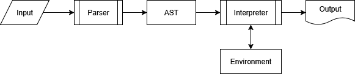

# Ներածություն

Հարգելի՛ ընթերցող, երբևէ մտածե՞լ եք, թե ինչպես է աշխատում ծրագրավորման լեզուն։ Ինչպե՞ս են համարյա մարդկային, երբեմն նույնիսկ գեղարվեստական, լեզվով գրված տեքստերը վերածվում մեքենայական հրամանների։ Եթե այս հարցերի պատասխանները ձեզ հետաքրքրում են, ապա մեր այս գիրքը հենց ձե՛զ համար է։ Եթե մի քիչ ծրագրավորում գիտեք, մի քիչ ծանոթ եք հիմնական տվյալների կառուցվածքներին ու ալգորիթմներին և ցանկություն ունեք զգալու, թե նախագծվում ու իրականացվում ծրագրավորման լեզուն, ապա համարձակ կարող եք սկսել ընթերցանությունը։

Այստեղ պատմում ենք ալգորիթմական լեզվի _ինտերպրետատոր_ իրականացնելու մասին։ Որպես ցուցադրման առարկա ընտրել ենք _Բալ ալգորիթմական լեզուն_։ Ինչպես արդեն կռահեցիք, _Բալ_ անունը ստացվել է ռեկուրսիվ սահմանումով. __Բ__ ― Բալ, __Ա__ ― ալգորիթմական, __Լ__ ― լեզու։ Այն Բեյսիկ (BASIC) լեզվի մի ենթատեսակ է՝ ազդված նաև Պիթոն (Python) և ՋավաՍկրիպտ (JavaScript) լեզուներից։  Բալն ունի _պրոցեդուրային_ ծրագրավորման լեզուներին յուրահատուկ բոլոր հիմնական հատկանիշները. թվային, տեքստային, տրամաբանական տիպեր, դրանց զանգվածներ, ղեկավարման կառուցվածքներ ու ենթածրագրեր։ Այս նվազագույն միջոցները թույլ են տալիս սահմանել ու իրագործել ալգորիթմների բավականին մեծ տեսականի։

Բալը _ուսումնական լեզու_ է։ Ավելին, սա պարզապես մի _փորձարարական նախագիծ_ է, որի օգնությամբ ցուցադրում ենք ինտերպրետատոր գրելու հիմնական միջոցներն ու հնարքները։ Այն նաև մի մեծ _վարժություն_ է, որը դո՛ւք, հարգելի՛ ընթերցող, կարող եք ընդլայնել ու հարստացնել։

Բալ ինտերպրետատորը, որպես գործիք, հրամանային տողի արգումենտով ստանում է `*.bas`, `*.bal` կամ `*.բալ` վերջավորությամբ տեքստային ֆայլ, վերլուծում է այդ ֆայլի պարունակությունն ու կառուցում _վերացական շարահյուսական ծառ_ (AST, abstract syntax tree), ապա, անցնելով ծառի հանգույցներով, կատարում, մեկնաբանում, _ինտերպրետացնում_ է դրանցում գրված տվյալներն ու արտածման ստանդարտ հոսքին է դուրս բերում ինտերպրետացիայի արդյունքը։



Օրինակ, եթե `hello.bas` ֆայլում ունենք բոլոր ծրագրավորողներին ծանոթ «hello, world» ծրագրի Բալ լեզվով գրված տարբերակը.

```bal
' առաջին ծրագիրը
SUB Main
  PRINT "Hello, world!"
END SUB
```

ապա, հրամանային տողում կատարելով `basic hello.bas` հրամանը, արտածման ստանդարտ հոսքին կտեսնենք `Hello, world!` տեքստը.

```bash
$ basic ./hello.bas
Hello, world!
```

Մեկ այլ օրինակ։ Ստորև բերված ծրագրում սահմանված է տրված ամբողջ թվի ֆակտորիալը անդրադարձ (ռեկուրսիվ) եղանակով հաշվող `Factorial` ենթածրագիրը։ `Main` ենթածրագում `Factorial`-ը կիրառվում է 10 արժեքին ու արտածվում է արդյունքը։

```bal
SUB Factorial(n)
    IF n = 1 THEN
        LET Factorial = 1
    ELSE
        LET Factorial = n * Factorial(n - 1)
    END IF
END SUB

SUB Main
    LET m = Factorial(10)
    PRINT m
END SUB
```

Գրքի շարադրանքը բաղկացած է հինգ գլուխներից.

1. __Լեզվի նկարագրությունը__ գլխում սահմանվում է Բալ ալգորիթմական լեզուն՝ Բեկուսի–Նաուրի ընդլայնված գրառմամբ (EBNF)։ Այստեղ լեզուն ներկայացվում է որպես ֆորմալ համակարգ՝ քերականությամբ և օրինակներով, որոնք կօգնեն հասկանալ դրա կառուցվածքը և հնարավորությունները։
2. __Վերլուծության ծառ__ գլխում լեզվի ծրագրերը դիտարկվում են արդեն ոչ թե որպես տեքստ, այլ որպես կառուցվածք։ Նկարագրվում են _վերացական շարահյուսական ծառի_ (_AST_, _abstract syntax tree_) հանգույցների տիպերը և դրանց դերն ինտերպրետատորի աշխատանքում։
3. __Շարահյուսական վերլուծություն__ գլուխը նվիրված է ծրագրի տեքստից AST ստացման պրոցեսին։ Այստեղ ներկայացվում են _բառային վերլուծության_ և _շարահյուսական վերլուծության_ հիմնական քայլերը, ինչպես նաև _իմաստաբանական վերլուծության_ որոշ տարրեր, որոնք անհրաժեշտ են ծրագրի ճիշտ մեկնաբանման համար։
4. __Ինտերպրետացիա__ գլխում նկարագրվում է, թե ինչպես է կառուցված վերլուծության ծառը «կենդանանում»։ Քննարկվում են արտահայտությունների _հաշվարկման_ և հրամանների _կատարման_ մեխանիզմները, ինչպես նաև _կատարման միջավայրերի_ և _հաշվարկման արժեքների_ գաղափարները։
5. __Վարժություններ__ գլուխը նախատեսված է նրանց համար, ովքեր ցանկանում են դուրս գալ գրքի շրջանակներից։ Այստեղ առաջարկվում են ինտերպրետատորի զարգացման տարբեր ուղղություններ՝ թե՛ լեզվի ընդլայնման, թե՛ արդեն իրականացված հնարավորությունների լավացման համար։

Ինտերպրետատորն ամբողջությամբ իրականացված է Go լեզվով (այս տեքստը գրելու պահին 1.25 տարբերակը)։ Go-ի ընտրությունը պայմանավորված է ոչ միայն դրա համեմատաբար պարզ և ընթեռնելի շարահյուսությամբ, այլև հարուստ ստանդարտ գրադարանով, որը թույլ է տալիս կենտրոնանալ իրականացվող լեզվի՝ Բալի գաղափարների վրա, այլ ոչ թե օժանդակ ենթակառուցվածքի իրականացման։ Բացի այդ, Go-ի շարահյուսական մոտեցումները մոտ են ինչպես արդյունաբերության մեջ լայնորեն կիրառվող լեզուներին, այնպես էլ ուսումնական նպատակներով օգտագործվող ծրագրավորման լեզուներին, ինչն այն դարձնում է հարմար միջավայր ինտերպրետատորի կառուցվածքը հասկանալու համար։ 

Ինտերպրետատորի իրականացումը բաժանված է չորս փոխկապակցված փաթեթների, որոնցից յուրաքանչյուրը պատասխանատու է համակարգի հստակ շերտի համար։ Այդ բաժանումը թույլ է տալիս լեզվի նկարագրությունը, վերլուծությունը և կատարումը դիտարկել որպես անկախ, բայց համագործակցող բաղադրիչներ։

1. _ast_ փաթեթում սահմանված են վերացական շարահյուսական ծառի հանգույցների տիպերը։ Այն ներկայացնում է ծրագրի ներքին կառուցվածքը՝ անկախ նրանից, թե ինչպես է ծրագիրը գրված տեքստային տեսքով կամ ինչպես է այն կատարվում։
2. _parser_ փաթեթը պատասխանատու է ծրագրի տեքստը ծառային կառուցվածքի վերածելու համար։ Այն ներառում է թե՛ բառային վերլուծիչը (scanner), որը ծրագրի տեքստը բաժանում է ինքնուրույն իմաստ կրող միավորների, և թե՛ շարահյուսական վերլուծիչը (parser), որը այդ նշաններից կառուցում է վերլուծության ծառը։
3. _interpreter_ փաթեթում իրականացված է լեզվի իրական կատարումը։ Այստեղ սահմանված են վերլուծության ծառի յուրաքանչյուր հանգույցի կատարման կանոնները, ինչպես նաև կատարման ընթացքում օգտագործվող օժանդակ կառուցվածքները՝ ներդրված ենթածրագրերը (builtins), հաշվարկված արժեքների պահման միջավայրը (environment) և դրանց հետ կապված տրամաբանությունը։
4. Վերջապես, _main_ փաթեթը կազմակերպում է վերլուծիչի և ինտերպրետատորի կանչը, ինչպես նաև ապահովում է վերլուծության ու կատարման ժամանակ առաջացած սխալների մասին հաղորդագրությունների արտածումը։

Մեր գրքով աշխատող ընթերցողը ցանկալի է, որ տարրական գիտելիքներ ունենա Գո լեզվից։ Ծանոթ լինի ինֆորմատիկայի դասընթացում ուսումնասիրվող հիմնական տվյալների կառուցվածքներին, օրինակ, ցուցակ, ծառ, ստեկ և այլն։ Կարողանա ինքնուրույն տեսական ուսումնասիրություններ կատարել ծրագրավորման լեզուների նախագծման ու իրականացման թեմայով։ Հույս ունենք, որ այս համեստ աշխատանքը գոնե ընդհանուր պատկերացում կտա ալգորիթմական լեզվի ինտերպրետատորի ստեղծման մասին։ Գրքի ավարտին ընթերցողը կունենա աշխատող ինտերպրետատոր և հստակ պատկերացում, թե ինչպես կարելի է նման համակարգը զարգացնել կամ վերափոխել։
