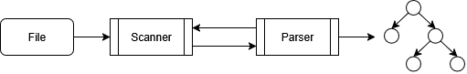

# Շարահյուսական վերլուծություն

## Վերլուծիչի կառուցվածքը

Շարահյուսական վերլուծիչը բաղկացած է երկու տրամաբանական մասերից. _բառային վերլուծիչ_ (`scanner`) և բուն _շարահյուսական վերլուծիչ_ (`Parser`)։ Բառային վերլուծիչը կարդում է ծրագրի տեքստը, առանձնացնում է իմաստ կրող հատվածները՝ _լեքսեմները_ (lexeme), ամեն մեկին համապատասխանեցնում է տիպը որոշող _պիտակ_ (token)։ Շարահյուսական վերլուծիչն արդեն, օգտագործելով պիտակավորված լեքսեմները և հետևելով քերականական կանոններին, կառուցում է վերլուծության ծառը։



Գծապատկերոում Scanner-ն ու Parser-ը միացնող սլաքներով ուզում եմ ցույց տալ, որ այդ երկու բաղադրիչներ աշխատում են իրար հետ համատեղ։ Երբ որոշում կայացնելու համար Parser-ին պետք է հերթական թոքեն-լեքսեմ զույգը, այն կանչում է Scanner-ի `next()` մեթոդը։


## Լեքսեմներ

Լեքսեմներն ու պիտակները սահմանված են `lexeme.go` ֆայլում։ Լեքսեմը ստրուկտուրա է, որը միավորում է պիտակը, լեքսեմի արժեքը և ֆայլի այն տողի համարը, որտեղ հանդիպել է լեքսեմը․

```Go
type lexeme struct {
    token int    // պիտակ
    value string // արժեք
    line  int    // տողը
}
```

Պիտակները սահմանված են որպես հաստտուններ։ Ահա դրանք՝ պայմանականորեն խմբավորված ըստ իմաստների․

```Go
const (
    xNone = iota

    // լիտերալներ
    xNumber // թիվ
    xText   // տեքստ
    xIdent  // իդենտիֆիկատոր
    xTrue   // TRUE
    xFalse  // FALSE

    // ծառայողական բառեր
    xSubroutine // SUB
    xDim        // DIM
    xLet        // LET
    xInput      // INPUT
    xPrint      // PRINT
    xIf         // IF
    xThen       // THEN
    xElseIf     // ELSEIF
    xElse       // ELSE
    xWhile      // WHILE
    xFor        // FOR
    xTo         // TO
    xStep       // STEP
    xCall       // CALL
    xEnd        // END

    // գործողություններ
    xAdd // +
    xSub // -
    xAmp // &
    xMul // *
    xDiv // /
    xMod // \
    xPow // ^

    xEq // =
    xNe // <>
    xGt // >
    xGe // >=
    xLt // <
    xLe // <=

    xAnd // AND
    xOr  // OR
    xNot // NOT

    // կետադրական նշաններ
    xNewLine  // <-/
    xLeftPar  // (
    xRightPar // )
    xLeftBr   // [
    xRightBr  // ]
    xComma    // ,

    xEof // ֆայլի վերջը
)
```

Որևէ լեքսեմի՝ տրված պիտակն ունենալը պարզելու համար է սահմանված `is()` մեթոդը․

```Go
func (l *lexeme) is(exps ...int) bool {
    return slices.Contains(exps, l.token)
}
```

Սա սահմանված է վարիադիկ տարբերակով, որպեսզի `e.is(xAdd) || e.is(xSub) || e.is(xAmp)` արտահայտության փոխարեն հնարավոր լինի գրել `e.is(xAdd, xSub, xAmp)`:


## Բառային վերլուծություն

Բառային վերլուծության (lexical analysis) ժամանակ Բալ ծրագրում պետք է առանձնացվեն ու պիտակավորվեն _ծառայողական բառերը_, _իդենտիֆիկատորները_, _գործողությունների_ սիմվոլները, _մետասիմվոլները_, _թվային_ ու _տեքստային_ լիտերալները։ Այս գործողության ժամանակ է, որ ծրագրի տեքստից հեռացվում են մեկնաբանություններն ու ավելորդ բացատանիշերը։

Օրինակ, դիտարկենք Բալ ծրագրի մի հատված, որում, պարզապես ցուցադրման համար, `␣` նիշով նշված է բացատը, իսկ `↵` նիշով՝ նոր տողին անցումը։

```basic
IF␣a␣>␣1.8␣THEN↵
␣␣␣␣LET␣s[2]␣=␣a^2↵
END␣IF↵
```

Բառային վերլուծիչը, նիշ առ նիշ կարդալով այս տեքստը, տրոհում է այն իմաստակիր հատվածների՝ _լեքսեմների_, ապա, ըստ լեզվի բառակազմական կանոնների, դրանցից ամեն մեկին համապատասխանեցնում է _պիտակ_։ Այսպես․

| Լեքսեմ | Պիտակ      |
|:------:|------------|
| `IF`   | `xIf`      |
| `a`    | `xIdent`   |
| `>`    | `xGt`      |
| `1.8`  | `xNumber`  |
| `THEN` | `xThen`    |
| `↵`    | `xNewLine` |
| `LET`  | `xLet`     |
| `s`    | `xIdent`   |
| `[`    | `xLeftBr`  |
| `2`    | `xNumber`  |
| `]`    | `xRightBr` |
| `=`    | `xEq`      |
| `a`    | `xIdent`   |
| `^`    | `xPow`     |
| `2`    | `xNumber`  |
| `↵`    | `xNewLine` |
| `END`  | `xEnd`     |
| `IF`   | `xEnd`     |
| `↵`    | `xNewLine` |

Տեսնում ենք, որ բացատներն ու մեկնաբանությունն ընդհանրապես անտեսվել են, իսկ նոր տողի նիշը, որ Բալի քերականության մեջ կարևոր տեղ է զբաղեցնում, ստացել է `xNewLine` պիտակը։

`scanner.go` ֆայլում իրականացված վերլուծիչը մոդելավորում է պարզագույն _վերջավոր ավտոմատ_։ Այդ ավտոմատի կոնտեքստը պահվում է `scanner` ստրուկտուրայում՝ սահմանված հետևյալ կերպ․

```go
type scanner struct {
	source *bufio.Reader // կարդալու հոսքը

	ch   rune   // ընթացիկ նիշը
	text string // կարդացված լեքսեմը
	line int    // ընթացիկ տողը
}
```

Սրա `source`-ը ծրագրի տեքստը պարունակող ֆայլին կապված կարդալու հոսքն է, որը, եթե խոսենք վերջավոր ավտոմատների տերմիններով, կատարում է _ժապավենի_ դերը։

Հոսքից մեկ հերթական լեքսեմը կարդալու ամբողջ տրամաբանությունը ծրագավորված է `scanner`-ի `next()` ֆունկցիայում։ Նրա աշխատանքի ալգորիթմն այսպիսինն է․

1. Ստուգել հոսքի վիճակը․ եթե այն _ավարտված_ է, ապա վերադարձնել `xEof` պիտակով լեքսեմ։
2. Քանի դեռ հոսքի հերթական սիմվոլը _բացատանիշ_ է, մասնավորապես՝ `␣`, `\t` կամ `\r`, ապա կարդալ ու դեն նետել դրանք։
3. Եթե հերթական նիշը _ապաթարցն_ `'` է, որը ցույց է տալիս մեկնաբանության սկիզբը, ապա կարդալ ու դեն նետել մինչ տողի վերջը հանդիպող բոլոր նիշերը։
4. Եթե հոսքի հերթական նիշը _թվանշան_ է, ապա կարդալ `[0-9]+(\.[0-9]+)?` կանոնավոր արտահայտությանը համապատասխանող իրական թիվ։
5. Եթե հերթական նիշը _չակերտ_ `"` է, ապա կարդալ տեքստային լիտերալ։
6. Եթե _տառ_ է, ապա կարդալ `[a-zA-Z][0-9a-zA-Z]*` կանոնավոր արտահայտությանը համապատասխանող հաջորդականություն։ Այնուհետև, օգտագործելով `keywords` աղյուսակը, պարզել, թե արդյոք կարդացած լեքսեմը ծառայողական բառ է, կամ իդենտիֆիկատոր։
7. Եթե հոսքում _նոր տողին անցման_ նիշ է, ապա մեկով ավելացնել `line`-ի արժեքը:
8. Եթե գործողության կամ այլ կետադրական ու ղեկավարող նիշ է, ապա կարդալ ու պիտակավորել այն։


## Շարահյուսական վերլուծություն

Շարահյուսական վերլուծիչը իրականացված է _ռեկուրսիվ վայրէջքի_ (_recursive descent_) եղանակով։ Վերլուծվող լեզվի քերականության ամեն մի կանոնի համար, այսինքն՝ ամեն մի ոչ տերմինալային սիմվոլի համար, սահմանվում է առանձին վերլուծող ֆունկցիա։ Որոշելու համար, թե վերլուծության որևէ քայլում ո՛ր ֆունկցիան պետք է կանչվի, օգտագործվում է _առաջ նայող_ (look-a-head) սիմվոլը։ Օրինակ, վերցնենք քերականության հենց առաջին հավասարումը.

```
Program = { Subroutine }.
```

Այստեղ հիշատակված են երկու ոչ տերմինալային սիմվոլներ. `Program` և `Subroutine`, ուրեմն, պետք է սահմանված լիեն, օրինակ, `parseProgram` և `parseSubroutine` ֆունկցիաները։ Կրկնություն որոշող `{...}` կառուցվածքը հուշում է, որ `parseSubroutine` ֆունկցիան պետք է կանչվի ցիկլի մեջ։ Բայց ո՞րն է ցիկլի կրկնության (կամ դադարի) պայմանը, մինչև ե՞րբ պետք է `parseSubroutine` ֆունկցիայով փորձել վերլուծել հերթական ենթածրագիրը։ Գիտենք, որ ենթածրագիրը սկսվում է `SUB` ծառայողական բառով. ուրեմն, քանի դեռ `lookahead`-ը `xSubroutine` է, կարող ենք կանչել `parseSubroutine` ու վերլուծել հերթական ենթածրագիրը։

```Go
func parseProgram() {
    for lookahead == "SUB" {
        parseSubroutine()
    }
}
```

`lookahead`-ի հետ աշխատելու համար վերլուծիչում սահմանված են `has` և `match` մեթոդները։ Առաջինը վարիադիկ մեթոդ է, որը պատասխանում է, թե արդյոք `lookahead`-ի պիտակը համապատասխանում է արգումենտում տրվածներից որևէ մեկին։

```Go
func (p *Parser) has(tokens ...int) bool {
	return p.lookahead.is(tokens...)
}
```

Մյուսը՝ `match`-ը ստուգում է, որ `lookahead`-ի պիտակը համապատասխանի տրված պիտակին։ Եթե այդպես է, ապա բառային վերլուծիչից կարդում է հաջորդ լեքսեմը ու վերադարձնում է առկա լեքսեմի արժեքը, իսկ հակառակ դեպքում գեներացնում է սխալ։ Ըստ էության, սա վերլուծության տարրական քայլն ապահովող գործողությունն է, որին հանդիպելու ենք վերլուծիչի համարյա բոլոր մեթոդներում։

```Go
func (p *Parser) match(exp int) (string, error) {
	if p.has(exp) {
		value := p.lookahead.value
		p.next()
		return value, nil
	}

	return "", fmt.Errorf("տող %d. Վերլուծության սխալ", p.lookahead.line)
}
```

Ինչպես արդեն հասկացանք, look-a-head մեխանիզմը թույլ է տալիս վերլուծել քերականություններ, որտեղ վերլուծության ուղղությունը որոշելու համար բավական է դիտարկել միայն մեկ սիմվոլ։

`parser.go` ֆայլում սահմանված է `Parser` ստուկտուրան․

```Go
type Parser struct {
	scer      *scanner // բառային վերլուծիչի ցուցիչ
	lookahead *lexeme  // look-a-head սիմվոլ
}
```

Ըստ Բալ լեզվի քերականության, `Parser` ստրուկտուրայի մեկական մեթոդներ են սահմանված ամեն մի քերականական հավասարման համար։ Այդ մեթոդների անունները համապատասխանեցված են հավասարման ձախ կողմի ոչ տերմինալային սիմվոլի հետ, իսկ մեթոդի տրամաբանությունը համապատասխանում է հաավասարման աջ կողմի կառուցվածքին։ Դիտենք, առաջին օրինակը ու սկսենք մեկնաբանել. վերցնենք լեզվի քերականության հենց առաջին քերականական հավասարումը.

```
Program = { Subroutine }.
```

Ըստ վերը ասվածի՝ `Parser` ստրուկտուրայի համար սահմանենք `parseProgram` անունով մեթոդ, որի մարմնում պետք է կանչել `parseSubroutine` անունով մեթոդն այնքան ժամանակ, քանի դեռ `scanner`-ի կարդացած հերթական լեքսեմի պիտակը `xSubroutine` է (այսինքն՝ բառային վերլուծիչը հարդացել է `SUB` ծառայողական բառը).

```Go
func (p *Parser) parseProgram() error {
	// բաց թողնել ֆայլի սկզբի դատարկ տողերը
	for p.has(xNewLine) {
		p.next()
	}

	// քանի դեռ տեսնում ենք SUB բառը
	for p.has(xSubroutine) {
		subr, err := p.parseSubroutine()
		if err != nil {
			return err
		}

		// հաջող վերլուծված ու կառուցված ենթածրագիրն
		// ավելացնել ենթածրագրերի ցուցակում
		p.program.Subroutines[subr.Name] = subr
		p.parseNewLines()
	}

	return nil
}
```

Կանոնը բավականին պարզ է. վերցնում ենք քերականական հավասարման ձախ կողմի ոչ տերմինալային սիմվոլ ու սահմանում ենք մեթոդ այդ անունով (բնակակնաբար, պարտադիր չէ, որ անունը նույնությամբ համընկնի, սա պայմանականությունը է), ապա վերցնում ենք հավասարման աջ կողմի արտահայտությունն ու, ձախից աջ անցնելով, եթե տարրը տերմինալային է, ապա համեմատում ենք `lookahead` նիշի հետ ու անցնում ենք առաջ, եթե տարրը ոչ տերմինալային է, ապա կանչում ենք համապատասխան մեթոդը։ Եթե օգտագործված է `[]` կառուցվածքը (ոչ պարտադիր), ապա բլոկը վերցնում ենք պայմանի տակ։ Եթե օգտագործված է `{}` կառուցվածքը (կրկնություն), ապա բլոկը վերցնում ենք ցիկլի մեջ։

Առաջ անցնենք ու դիտարկենք ենթածրագրի վերլուծությունը։ Հիշենք քերականական կանոնը.

```
Subroutine = 'SUB' IDENT ['(' IdentList ')'] Sequence 'END' SUB'.
```

Արդ, սահմանում ենք `parseSubroutine` մեթոդը՝ դեռ բաց թողնելով AST-ի կառոցման և սխալներին արձագանքման հատվածները։

```Go
func (p *Parser) parseSubroutine() {
	...
```

Ծրագրավորենք ենթածրագրի վերնագիրը՝ `'SUB' IDENT ['(' IdentList ')']`։ Այստեղ `SUB`-ը և `IDENT`-ը տերմինալներ են, իսկ պարամետրերի ցուցակը պարտադիր չէ։ Ուրեմն.

```Go
	...
	// վերնագրի վերլուծություն
	p.match(xSub)
	p.match(xIdent)

	if p.has(xLeftPar) {
		p.match(xLeftPar) // '('
		p.parseIdentList()
		p.match(xRightPar) // ')
	}
	...
```

Այնուհետ՝ ենթածրագրի մարմինը. `Sequence 'END' SUB'`, որտեղ `Sequence`-ը ոչ տերմինալային է. կանչում ենք դրա մեթոդը, `END`-ը և `SUB`-ը տերմինալային են։

```Go
	...
	// մարմնի վերլուծություն
	p.parseSequence()

	p.match(xEnd)
	p.match(xSubroutine)
}
```

Նկատենք, որ կոդի այս հատվածը տառացիորեն համապատասխանում է քերականական հավասարմանը։
